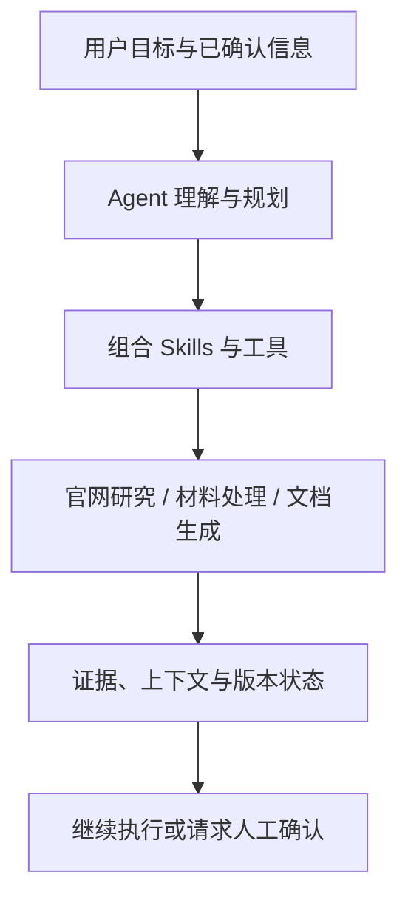
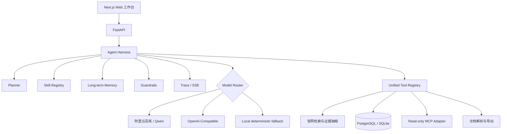

<p align="center">
  
</p>

<p align="center">
  <strong>面向留学场景的开放式 Agent：理解目标，调用工具，处理材料，持续完成任务</strong>
</p>


<p align="center">
 画像理解 · 项目研究 · 官网核验 · 材料处理 · 工具调用 · 长任务执行
</p>

<p align="center">
  
  <a href="https://github.com/limouren2000/YYGlobal/stargazers">
    
  </a>
  <a href="https://github.com/limouren2000/YYGlobal/forks">
    
  </a>
  
  
  
  
</p>

<p align="center">
  <a href="#-一分钟启动">一分钟启动</a> ·
  <a href="#-当前应用能力">当前能力</a> ·
  <a href="#-agent-内核">Agent 内核</a> ·
  <a href="#-项目截图">项目截图</a> ·
  <a href="#-开发与验证">开发与验证</a>
</p>

---

## ✦ YYGlobal 是什么？

YYGlobal 是一个开源留学申请 Agent。它不是只会聊天的问答机器人，而是一个面向留学场景持续演进的 **Application Agent**：理解用户目标，读取已确认的信息，调用工具处理真实材料，保留关键证据，并在任务推进过程中维护必要的上下文与状态。

留学申请是当前的主要应用场景，不是产品能力的最终边界。未来 YYGlobal 会逐步从固定的申请功能中抽象出更通用的 Agent 能力，让 Agent 能够理解更开放的目标、组合 Skills 与工具，并自主完成更长链路的任务。

> **核心设计：** 让 Agent 理解目标、调用工具、保留证据、维护上下文，并在需要人工确认的边界暂停执行。

| 你想做什么 | 从这里开始 |
| --- | --- |
| 第一次体验完整产品 | [Docker Compose 一分钟启动](#-一分钟启动) |
| 了解当前已经实现的能力 | [查看当前应用能力](#-当前应用能力) |
| 了解大模型、Skills、Memory、MCP | [查看 Agent 内核](#-agent-内核) |
| 不配置 API Key 先跑起来 | 使用内置的确定性本地 Agent 模式 |
| 接入真实大模型 | 配置阿里云百炼或 OpenAI 兼容 Provider |
| 了解后续 Agent 能力建设 | 查看 Roadmap |

## 🚀 一分钟启动

前置条件：已安装 Docker Desktop 与 Docker Compose。

```bash
cp .env.example .env
docker compose up --build
```

启动完成后：

- Web 工作台：<http://localhost:3000>
- API：<http://localhost:8000>
- Swagger API 文档：<http://localhost:8000/docs>

首次构建需要下载 Python 与前端依赖，耗时取决于网络；看到依赖持续下载并不代表卡死。再次启动会复用 Docker 缓存。

### 接入阿里云百炼（推荐）

在 `.env` 中填写：

```dotenv
LLM_PROVIDER=auto
DASHSCOPE_API_KEY=sk-你的百炼APIKey
DASHSCOPE_BASE_URL=https://dashscope.aliyuncs.com/compatible-mode/v1
DASHSCOPE_REASONING_MODEL=qwen-plus
DASHSCOPE_EXTRACTION_MODEL=qwen-vl-plus
```

`auto` 会依次尝试阿里云百炼、OpenAI；两个 Key 都为空时自动进入本地 Agent 模式。因此，没有 API Key 也能启动、浏览产品并运行确定性演示能力。

加载演示学生、项目和材料数据：

```bash
make seed-demo
```

如需让演示文稿也通过当前大模型生成：

```bash
make seed-demo-llm
```

## 🧭 当前应用能力

当前版本以留学申请作为主要应用场景，用来验证 Agent 的目标理解、工具调用、证据保留、材料处理和长任务执行能力。下面的内容是当前能力在留学场景中的一种应用，不代表未来只能服务于固定的申请软件或业务流程。



### 当前留学场景能力

1. **理解用户画像与材料**：读取目标国家、专业、学术背景、GPA、语言成绩、预算、偏好以及用户确认过的经历和材料。

2. **研究项目与官方信息**：基于用户目标研究项目，按需核验学校官网，并保留截止日期、费用、成绩和材料要求的来源与核验状态。

3. **处理申请材料**：解析已有 CV / PS，生成或修改通用材料和项目相关材料，并保留不可覆盖的版本链。

4. **推进长期任务**：维护项目、材料、工具调用、错误、耗时和输出状态；在提交、付款、发邮件等外部写操作前等待人工确认。

5. **持续抽象 Agent 能力**：当前的留学 Skills 会逐步沉淀为更通用的目标理解、规划、工具调用、记忆、验证和执行能力。

## 🧠 Agent 内核

YYGlobal 的 Agent 能力主要由 Python 实现，业务页面只是可视化入口。



| 能力 | 当前实现 |
| --- | --- |
| **Harness / Loop Engineering** | 限制最大步骤、工具调用数、超时与重试；把规划、执行、观察和输出串成可控循环 |
| **Planning** | 根据目标和选中的 Skill 生成显式执行计划，并通过 SSE 向前端展示进度 |
| **Professional Skills** | 画像、项目研究、项目对比、三档选校、CV、PS、申请时间线 7 个领域 Skills |
| **Tool Calling** | 统一 Tool Registry、JSON 参数、权限策略、调用结果与耗时追踪 |
| **Memory** | 持久化已确认画像与偏好，支持查看和删除；未确认信息不会变成长期事实 |
| **Grounding** | 关键项目字段绑定官网证据；材料只使用用户已确认的经历，不虚构指标 |
| **MCP** | 提供可运行的只读 MCP 形态适配器，用于验证工具发现、白名单和统一调用链 |
| **Guardrails** | 区分只读与写操作；提交、付款等不可逆动作必须等待人工确认 |
| **Model Routing** | 阿里云百炼、OpenAI 兼容接口与无 Key 本地回退模式 |
| **Observability** | Agent Run、计划、工具调用、错误、耗时和最终输出均可追踪 |

Skills 位于 [`services/api/app/skills`](services/api/app/skills)，Agent 核心位于 [`services/api/app/agent`](services/api/app/agent)。每个专业 Skill 都有元数据、提示词、输入输出 Schema、工具权限和评测样例；它们是专业能力模块，不是 7 个独立 Agent。

## 🖼️ 项目截图

### 从今天最重要的申请动作开始


### 画像驱动的项目推荐 + 官网证据核验


### 冲刺 / 主申 / 稳健选校 + 独立项目申请包


### 选择项目后，再生成和管理对应的 CV / PS


## 🧱 技术栈

| 层 | 技术 |
| --- | --- |
| Web | Next.js 15、React 19、TypeScript、Tailwind CSS、TanStack Query |
| API | Python、FastAPI、Pydantic、SQLAlchemy Async、Alembic |
| Agent | Custom Harness、Planner、Skills、Tool Calling、Memory、MCP、Guardrails、Trace |
| LLM | 阿里云百炼 Qwen、OpenAI 兼容 Provider、本地确定性回退 |
| Document | PyMuPDF、python-docx、DOCX / PDF 导出 |
| Research | httpx、BeautifulSoup、Trafilatura、官网证据抽取 |
| Storage | PostgreSQL（Docker）/ SQLite（本地开发）、上传文件卷 |
| Delivery | Docker Compose、pnpm、pytest、Vitest、Ruff、ESLint |

## 🗂️ 目录结构

```text
YYGlobal/
├── apps/web/                 # Next.js 学生端工作台
├── services/api/
│   ├── app/agent/            # Harness / Planner / Memory / MCP / Tools
│   ├── app/skills/           # 7 个留学申请专业 Skills
│   ├── app/api/              # FastAPI 路由
│   ├── app/services/         # 项目核验、材料生成、文档导出
│   └── tests/                # API、Agent、Provider 与安全边界测试
├── scripts/                  # 演示数据、评测和 HTTP 冒烟测试
├── docs/assets/              # README 与产品展示图片
├── docker-compose.yml
└── Makefile
```

## 🛠️ 本地开发

```bash
make install
```

终端一：

```bash
make dev-api
```

终端二：

```bash
make dev-web
```

开发模式支持热更新；Docker Compose 更接近完整部署环境，修改依赖或镜像内容后需要重新构建。

## ✅ 开发与验证

```bash
make lint
make test
make build
services/api/.venv/bin/python scripts/run_agent_evals.py
services/api/.venv/bin/python scripts/smoke_test.py
```

`smoke_test.py` 需要 Web、API 和数据库服务已经启动。

## 🛡️ 安全与数据原则

- 重要项目信息优先引用学校或机构官方来源，并记录最后核验状态。
- Agent 不承诺录取结果，不把推断写成官方要求。
- CV / PS 只使用学生确认的真实经历，禁止补造课程、奖项和量化结果。
- 项目材料和生成稿按项目、类型、版本独立管理。
- 提交申请、付款、发送邮件等外部写操作必须经过用户确认。
- 默认 `AUTH_ENABLED=false`，适合单人本地或受信环境，公网多用户认证与租户隔离仍在建设中。

## 🗺️ Roadmap

- [x] 学生画像、经历库与长期记忆
- [x] 项目目录、画像匹配和官网按需核验
- [x] 冲刺 / 主申 / 相对稳健三档清单
- [x] 独立项目申请包与材料缺口检查
- [x] 通用 CV、项目级 CV / PS 与不可覆盖版本链
- [x] DOCX / PDF 导出
- [x] 基础申请任务与状态看板
- [ ] 可选认证服务、首位注册管理员与多用户数据隔离
- [ ] 申请门户自动填表、截图留痕与提交前人工审批
- [ ] Gmail / Outlook 邮箱监控、邮件分类与截止日期联动
- [ ] 推荐信、成绩单、作品集等材料的项目级深度检查
- [ ] 生产级 MCP Server / Client 与更多官方数据工具

---

<p align="center">
  <strong>YYGlobal</strong> · Make every application decision explainable.
</p>

<p align="center">
  如果这个方向对你有帮助，欢迎留下反馈，或从一个真实任务中的具体问题开始改进它。
</p>

## 💬 交流群

欢迎加入 YYGlobal 交流群，讨论产品体验、留学申请工作流、Agent 开发与项目贡献。

<p align="center">
  
</p>

<p align="center">
  扫描二维码加入交流群
</p>
